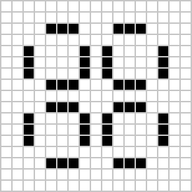

# Oczekiwane zachowanie wzorców z wizualizacją

## Blinker 
Oscyluje między linią poziomą i pionową co turę.
  ```
  Tura 0:
  000
  111
  000

  Tura 1:
  010
  010
  010
  ```
  Powtarza się co 2 tury.

## Glider
 Porusza się po planszy po skosie, powracając do pierwotnego kształtu po 4 turach.

  
  
  Plansza 5x5.


## Toad
 Oscyluje między dwoma kształtami.
  ```
  Tura 0:
  0000
  0111
  1110
  0000

  Tura 1:
  0010
  1001
  1001
  0100
  ```
  Powtarza się co 2 tury.

## Pulsar
 Pulsuje co 3 iteracje, zmieniając swoją wielkość i układ komórek.

  

  Plansza 15x15.

## LWSS
 Przesuwa się w lewo co 4 iteracje, zachowując swój kształt.
  
  

  Plansza 8x10.

 ## **Więcej na [LifeWiki](https://conwaylife.com)**
